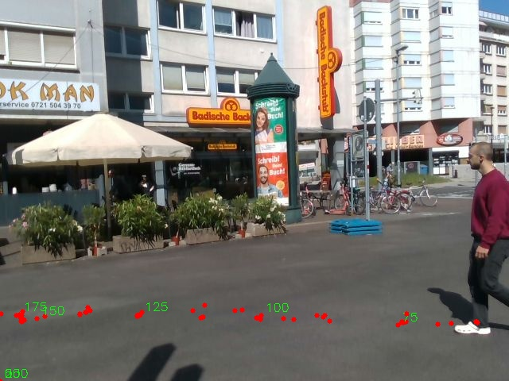

# Introduction
This repository contains the code developed as part of my Bachelor's Thesis. The project focuses on processing:
+ video footage captured by an embedded camera mounted on a static ARI robot, providing an egocentric view of the environment
+ Vehicle to Everything (V2X) data sent from an On Board Unit (OBU) mounted on an EBike.

# Methodology

Refer to the Bachelor's Thesis.

# Test Data Creation
If you need to extract your video and frames from rosbag files, please refer to the following [tutorial](https://github.com/Ludivine388/Crash-Prediction/tree/main/rosbag%20data%20extractor)
After extracting the needed data, make sure to store it in `Trajectory Prediction/test_data` \


For V2X data, refer to :
[OBU Data Tutorial](https://github.com/Ludivine388/Crash-Prediction/tree/main/OBU%20Data)
Transfer your log files to `Trajectory Prediction/test_data`

# Setup 

All the codes have been run and tested on a docker container created with :
`FROM nvidia/cuda:12.6.1-base-ubuntu24.04`
and following driver : 
+ NVIDIA GeForce RTX 4060

Install then the followings :
+ [cuDNN 9.5.1](https://developer.nvidia.com/cudnn-downloads)
+ Python 3.10.15

Create a virtual environment with python3.10.15 and activate it:
```
python3 -m venv myenv
source myenv/bin/activate
```

Install tensorflow and torch 2.5.1+cu124:
```
pip install tensorflow
pip install torch torchvision
```

Finally, you need to install the following packages to run the python scripts :
+ numpy
+ h5py
+ scikit-image
+ opencv-python
+ joblib
+ matplotlib
(pip install <package>)

Clone this repository in your environment and start working on you crash prediction!

FYI : with update-alternatives python3.10 is executed when running python (and not python3) in the following instructions

# 1. V2X Data Processing

To preprocess the vehicle data:
Run from [/v2x_data](https://github.com/Ludivine388/Crash-Prediction/blob/main/Trajectory%20Prediction/v2x_data/get_veh_data.py):
`python get_veh_data.py` \ 
**-> Output** : corrected timestamp for each block value
serialized object : ../test_data/veh_data

Additional code:
`python get_veh_data.py` : This code calculates the average time taken to write a new block of values.
The accurate timestamps are from the OBU mounted on the robot. Change path at line 40 and run script.
`python gps_map.py`: This code generates a satellite map visualization for each GPS coordinate and timestamp from the V2X data. Provide path to files generated by get_veh_data.py and run script.
`python viz_gps.py`: Code creates video from png map files and saves it as output.mp4. Change path at line 36 to your own map_images folder (can be generated by gps_map.py) and run script

# 2. Depth Analysis
Follow [Instructions](https://github.com/Ludivine388/Crash-Prediction/tree/main/Trajectory%20Prediction/get_depth) \
Run :
`python get_depth.py` \

**-> Output** : n PNG image data, 1280 x 480, 8-bit/color RGB, non-interlaced

Visualization exemple: \


# 3. Pose Calculation
Follow [Instructions](https://github.com/Ludivine388/Crash-Prediction/tree/main/Trajectory%20Prediction/get_pose) \
Run: 
`python get_pose.py` \

**-> Output** :
+ n data file: each frame file contains binary pose information about detected person (pixel coordinates of detected keypoints)
+ n PNG image data, 640 x 480, 8-bit/color RGB, non-interlaced

Visualization exemple:  \


# 4. Generate Tensor
Follow [Instructions](https://github.com/Ludivine388/Crash-Prediction/tree/main/Trajectory%20Prediction/get_tensor) \
Run:
`python generateTensor_Kalman.py`




**-> Output** :
+ n data file: each frame file contains information about detected person in 3D system
+ n PNG image data, 640 x 480, 8-bit/color RGB, non-interlaced

Visualization exemple: \


# 5. Crash Prediction

First get GPS coordinates for vehicle and pedestrians for each timestamps.
The timestamps are retrieved from the video data and fps value.
In [/get_gps_trajectory](https://github.com/Ludivine388/Crash-Prediction/tree/main/Trajectory%20Prediction/get_gps_trajectory)
**Input** : TENSOR from section 4 Generate Tensor
            frame forlder of video to analyze and vehicle data from section V2X Data
`python get_ped_gps.py`
`python get_veh_gps_per_frame.py`
**-> Output** :
GPS coordinates of both pedestrian and vehicle for timestamp t
In [/crash_prediction](https://github.com/Ludivine388/Crash-Prediction/tree/main/Trajectory%20Prediction/crash_prediction)
`python crash_prediction.py`
