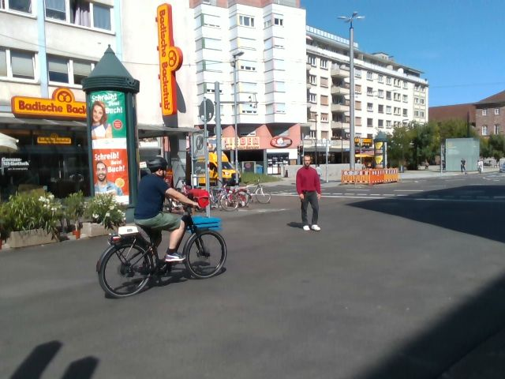
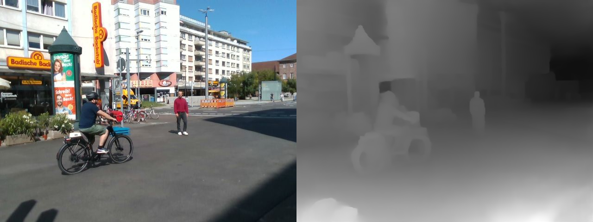
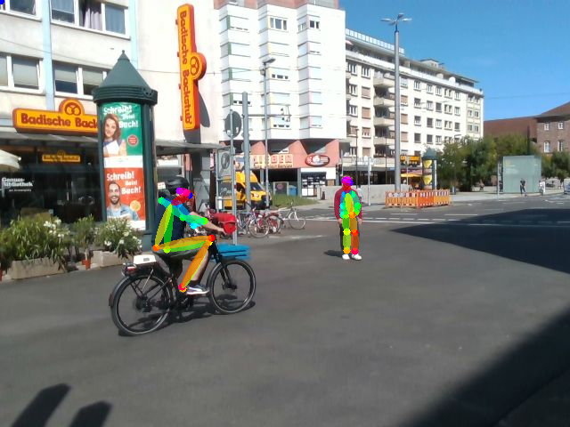
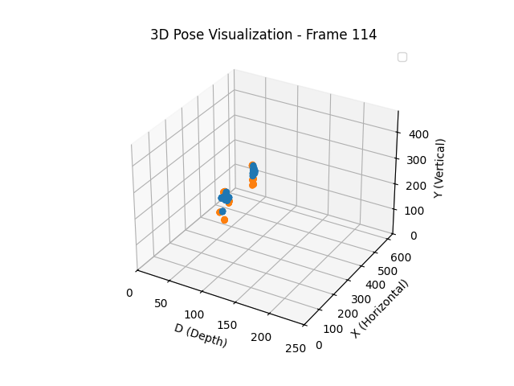

# Introduction
This repository contains the code developed as part of my Bachelor Thesis. The project focuses on processing:
+ video footage captured by an embedded camera mounted on a static ARI robot, providing an egocentric view of the environment
+ Vehicle to Everything (V2X) data sent from an On Board Unit (OBU) mounted on an EBike.

# Methodology

TODO

# Test Data Creation
If you need to extract your video and frames from rosbag files, please refer to the following [tutorial](https://github.com/Ludivine388/Crash-Prediction/tree/main/rosbag%20data%20extractor)
After extracting the needed data, make sure to store it in `Trajectory Prediction/test_data`


For V2X data, refer to :
[OBU Data Tutorial](https://github.com/Ludivine388/Crash-Prediction/tree/main/OBU%20Data)
Transfer your log files to `Trajectory Prediction/test_data`

# Setup 

All the codes have been run and tested on a docker container created with :
`FROM nvidia/cuda:12.6.1-base-ubuntu24.04`
and following driver : \
+ NVIDIA GeForce RTX 4060

Install then the followings :
+ [cuDNN 9.5.1](https://developer.nvidia.com/cudnn-downloads)
+ Python 3.10.15

Create a virtual environment with python3.10.15 and activate it:
```
python3 -m venv myenv
source myenv/bin/activate
```

Install tensorflow and torch 2.5.1+cu124:
```
pip install tensorflow
pip install torch torchvision
```

Finally, you need to install the following packages to run the python scripts :
+ numpy
+ h5py
+ scikit-image
+ opencv-python
+ joblib
+ matplotlib
(pip install <package>)

Clone this repository in your environment and start working on you crash prediction!

FYI : with update-alternatives python3.10 is executed when running python (and not python3) in the following instructions

# 1. Depth Analysis
Follow [Instructions](https://github.com/Ludivine388/Crash-Prediction/tree/main/Trajectory%20Prediction/get_depth) \
Run :
`python get_depth.py`

Visualization exemple:


# 2. Pose Calculation
Follow [Instructions](https://github.com/Ludivine388/Crash-Prediction/tree/main/Trajectory%20Prediction/get_pose) \
Run: 
`python get_pose.py`
Visualization exemple:


# 3. Generate Tensor
Follow [Instructions](https://github.com/Ludivine388/Crash-Prediction/tree/main/Trajectory%20Prediction/get_tensor) \
Run:
`python generateTensor_Kalman.py`
Visualization exemple:


# 4. V2X Data Processing

# 5. Crash Prediction
